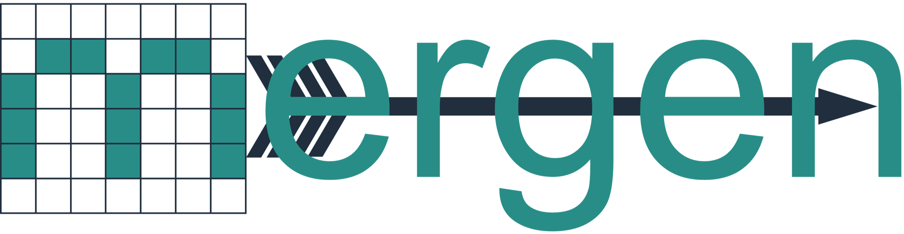

<p align="center">
  <picture>
    <source media="(prefers-color-scheme: dark)" srcset="docs/_static/logo-dark.png">
    
  </picture>
</p>

<p align="center"><b>M</b>ulti-dimensional <b>E</b>xperimental <b>R</b>un <b>GEN</b>erator:
space-filling Design of Experiments for Python.</p>

<p align="center">
  <a href="https://github.com/acanbay/mergen/actions/workflows/tests.yaml"></a>
  <a href="https://www.python.org"></a>
  <a href="https://mergen.readthedocs.io"></a>
  <a href="https://opensource.org/licenses/MIT"></a>
</p>

---

## What is Mergen?

Every experimental study works under a fixed budget: only a limited
number of runs can be afforded, and each one should be as informative
as possible. Mergen selects those runs. Given a parameter space (its
bounds, resolution, constraints and critical regions), it computes
the coordinates of *n* points that spread evenly through the space,
so that no region is left unexplored and no run is wasted.

The result is not a random sample but a mathematically optimised
design, delivered together with a statistical quality report suitable
for the methods section of a paper. Mergen handles the spaces real
studies actually have: mixed factor types, forbidden regions, runs
that already exist, and zones that deserve extra attention.

## Features

- **Factor types:** discrete, continuous (linear or log), integer,
  nominal and ordinal, freely mixed in one space, with feasibility
  constraints.
- **Design control:** prescribed points, focus regions, exclusion
  zones, named extra sets, and resuming from an existing design.
- **Optimisation:** seven space-filling criteria (including recent
  developments such as uMaxPro and the stratified L2-discrepancy)
  and three optimisers over a discrete-grid Latin-hypercube
  structure, with a `compare()` sweep for when you are unsure.
- **Evidence and export:** a Monte Carlo quality report, eight plot
  types, and CSV, JSON, Markdown, LaTeX, HTML and Excel export.
- **Sequential workflows:** extend, subsample, reorder and nest
  designs as a campaign grows.

## Installation

```bash
pip install mergen-doe
```

Optional Excel export support:

```bash
pip install "mergen-doe[excel]"
```

To work on Mergen itself, install from source in editable mode and
add the extras you need:

```bash
git clone https://github.com/acanbay/mergen.git
cd mergen
pip install -e .            # the package itself
pip install -e ".[excel]"   # openpyxl, for result.to_excel()
pip install -e ".[dev]"     # pytest, coverage, ruff, black
pip install -e ".[docs]"    # Sphinx toolchain
```

The distribution name is `mergen-doe`; the import name is `mergen`.
Requires Python 3.9 or newer; the core dependencies (NumPy, SciPy,
pandas, matplotlib) are installed automatically.

## Quick start

```python
from mergen import ParameterSpace, Sampler

space = ParameterSpace({
    'temperature': range(100, 500, 10),        # discrete
    'pressure':    ('continuous', 0.5, 5.0),   # continuous grid
    'n_layers':    ('integer', 2, 10),         # integer grid
})

sampler = Sampler(space)
sampler.set_design(n_samples=30)
result = sampler.run()

result.summary()
result.quality_report()
result.plot('pairplot', save=True)
result.to_csv()
```

## Documentation

The full documentation lives at
**[mergen.readthedocs.io](https://mergen.readthedocs.io)**. It covers
tutorials, task guides, the reasoning behind every choice Mergen asks
you to make, an executed gallery of fifteen example studies with
their complete output and figures, and the full API reference.

To build it locally, install the `docs` extra (see Installation) and
run `sphinx-build -b html docs docs/_build/html`, then open
`docs/_build/html/index.html`.

## Examples

Fifteen complete, runnable studies from different domains live in
[`examples/`](examples/), from a five-line quickstart to CFD,
wet-lab and particle-physics campaigns.

## Citing

If you use Mergen in academic work, please cite it using the
information in [`CITATION.cff`](CITATION.cff); GitHub renders it
under the "Cite this repository" button.

## License

MIT © Ali Can Canbay
